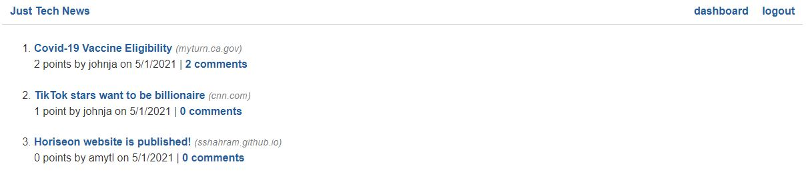
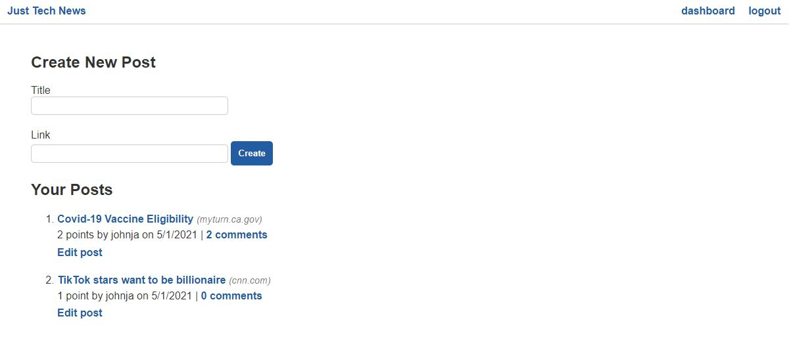
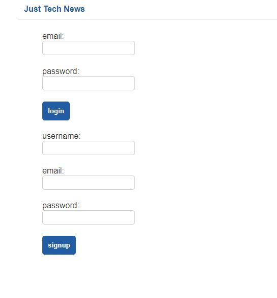

# Just-tech-news


## Description

"Just-tech-news" is a technology news website built with a polished and clean frond end and a robust back end. Using this website, users are able to sing up for new accounts and then use their login credentials to login back at a later time. They are also able to view their own dashboard which shows all their posts along with the ability to edit/delete their posts. In addition, users are able to view other members' posts in the main webpage and make comments and vote on them.

## Table of Contents

* [Description](#description)
* [Table of Contents](#table-of-contents)
* [Usage](#usage)
* [License](#license)
* [Contributing](#contributing)
* [Tests](#tests)
* [Live-URL](#Live-URL)
* [Screenshots](#screenshots)
* [Questions](#questions)

## Usage

Please first install Node.js and MySQL Shell on your computer.

Second, update ./config/connection.js file with your MySQL username and password.

Third, run the following commands inside your terminal:

```bash
git clone <from-repository-on-github>
npm install
run schema.sql
node server.js
```
Or you can use the link provided in the "Live-URL" section to view the deployed application on heroku.

## License

[MIT](https://choosealicense.com/licenses/mit/)

## Contributing

Pull requests are welcome. For major changes, please open an issue first to discuss what you would like to change.

## Tests

You can use "Insomnia Core" or "Postman" to test different API routes for "users", "posts" and "conments". The following routes have been implemented in the backend:
1. Get all data
2. Get a single data using the ID
2. Post a new data
3. Put (update) a single data using the ID
4. Delete a single data using the ID

## Live-URL

This application is also deployed on Heroku. Please checkout the following link for the live url: 
* [Live-URL](https://just-tech-news-0430-ss.herokuapp.com/)


## Screenshots

Please see below for the screenshots of homepage, dashboard and sign in/sign up pages:
* Homepage:



* Dashboard:



* Sign In / Sign Up:



## Questions

If you have any questions please use the following two links to contact me:

* [GitHub](https://github.com/sshahram)

* [Email Address](mailto:shirin.shahram23@gmail.com)